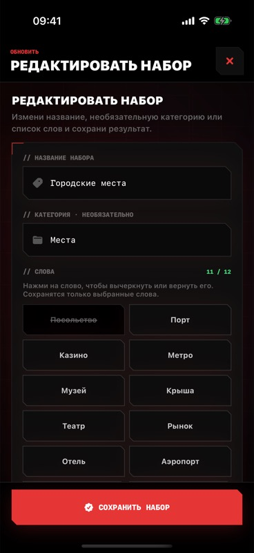
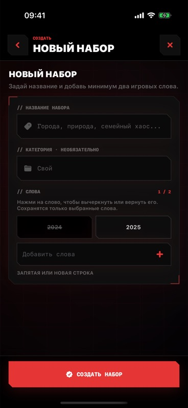
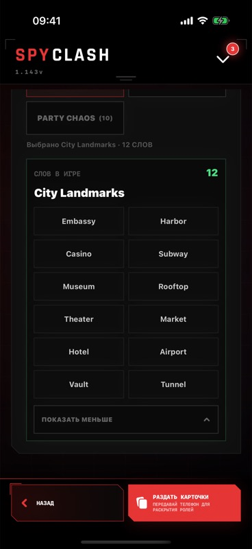
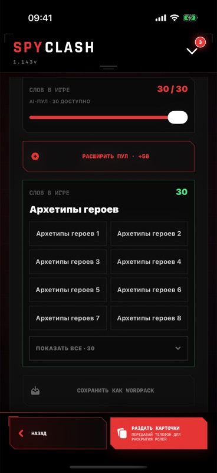
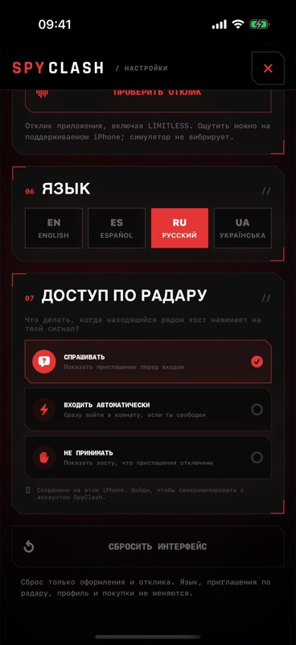
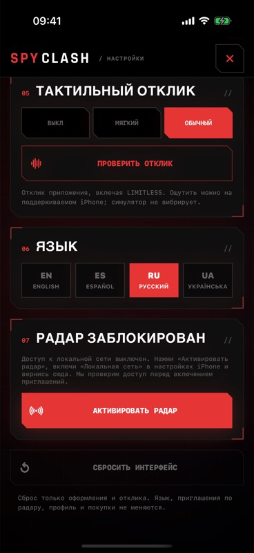

# Partner bug report: Build 143

Prepared 2026-09-06, Europe/Bratislava. **Local fixes verified; production unchanged.**

The supplied screenshots show Build 132. The main checkout remained Build 106. Work was isolated on `davidganzha/partner-bugfix-143`, based on the verified latest `origin/davidganzha/restore-limitless` commit `0b76fdb` / Build 142. It includes the recent Radar compatibility and interface changes. `MARKETING_VERSION` remains 1.0.1; both project build values are 143.

## Confirmed backend incident

Fresh Base44 logs and lifecycle records confirmed `active_lease` across lobby create/join/update/close, generation and word-pack writes. A room change at 2026-09-05 21:05:21 UTC was followed by a 600 ms signal timeout and an HTTP response while local work remained in flight. The host account lease remained until approximately 21:15:21 UTC. The deployed source contains the same `Promise.race` defect. This is shared writer contention, not evidence that the user's identity was actually being migrated.

The fix stops starting secondary work after its time budget, waits for started work and lease cleanup, and prevents parallel failures from abandoning sibling writes. It covers lobby and finished-game signals and the analogous queued Live Activity delivery. Storage failure can still cause a release attempt to fail and fall back to the existing expiry; slow in-flight storage can extend response time. Account deletion guards and lease TTL are preserved.

See [exact production candidate](backend-deployment-scope.md), [runtime patch](backend-incident-only.patch), and [hash manifest](backend-runtime-manifest.json). The deployable candidate changes exactly two functions and five runtime files from the observed production baseline. It deliberately excludes unrelated differences already present in the newer source branch. No deployment, secret/schema/site change, payment action or App Store upload was performed.

## All reported items

| # | Report | Implemented / verified | Remaining acceptance |
| --- | --- | --- | --- |
| 1 | Lobby joins fail with 409 | Confirmed shared account lease leak; local backend regression covers slow signal then successful join acquisition. | Deploy approved candidate; two authenticated clients create/join/rejoin and close rooms. |
| 2 | QR recognition/aiming unreliable | Standard black-on-white generated QR with quiet zone; capture config/start/stop on serial queue; continuous/tap focus, foreground/interruption recovery; invalid QR cannot latch scanner; valid code preferred among visible codes; camera Settings recovery. Rotated rendered codes decode at 224 px. | Physical camera, bright/dim screens, near/far/angled aiming; actual join after recognition. |
| 3 | Intermittent theme generation 409 | Same live account lease cluster; generation writer can acquire immediately after completed cleanup in regression test. | Real generation after deployment. |
| 4 | No local word list | Selected saved and generated pools display the exact `localPlayablePool` used for gameplay, with expand/collapse. Both screens checked in Simulator. | Human acceptance on phone. |
| 5 | Arsenal edit uses text block | Individual reversible word cards; selected count, validation and saved snapshot exclude crossed-out words. Tap verified 12→11. | Real save/reopen after server fix. |
| 6 | Arsenal create uses text block | Same word cards in creation; add-word input normalizes/deduplicates; create screen and strike-through checked. AI results use this same draft editor. | Real AI creation and save/reopen after server fix. |
| 7 | Online lobby pack creation 409 | Same shared lifecycle writer leak; save-pack acquisition included in regression. | Save from real online lobby after deployment. |
| 8 | Regeneration/count changes cause 409 | Shared account lease fixed at its source; no blind replay of a possibly committed AI action added. | Generate, regenerate with lower/higher count, and expand from both clients. |
| 9 | Missing invitation prohibition | Restored ask / automatic / blocked, removed persisted and remote blocked→ask normalization; three choices visually checked. | Cross-device policy propagation. |
| 10 | Denied Local Network needs blocked block | Shared permission coordinator; denied block with Activate; verify on foreground including independent Settings changes; show policies after confirmed grant. Blocked UI checked with DEBUG Simulator fixture. | Physical deny→Settings allow→return, revoke→return; first permission prompt. |
| 11 | Nearby enabled people disappear | Same-account profile updates preserve session/peers/invites; empty browser refreshes at 12/24/48 s without rebuilding the session; Bonjour fields bounded by UTF-8 bytes. v4/v5 compatibility retained. | 132↔143 and143↔143 discovery in both directions; passive Home device; foreground/background/Wi-Fi recovery; UWB separately. |

## Verification

- iOS Debug and Release Simulator builds succeeded. Release compilation used `CODE_SIGNING_ALLOWED=NO`; it is not a signed device/App Store archive. Full XCTest run: **438 passed, 0 failed, 0 skipped**.
- XCTest result: `/Users/davidganzha/Library/Developer/XcodeBuildMCP/workspaces/SpyClash-f8b83e29e9ef/result-bundles/test_sim_2026-09-05T22-08-26-210Z_pid23192_0e4f9572.xcresult`.
- The first QR pixel test encountered a Simulator Vision inference limitation. It passed using the supported legacy CPU barcode decoder; the final complete run includes it. Its two deprecation warnings are confined to test code.
- Integrated relevant backend tests: **647 passed**; isolated production-based candidate tests: **50 passed**; changed backend entry points/helpers type-check.
- Cross-platform room/Community contracts, client entity boundaries, entity RLS completeness, runtime bundle isolation, and `git diff --check` pass. The runtime bundle guard excludes local `*_test.ts` integration files, matching deployment staging; runtime imports remain checked.
- Candidate and fresh baseline guards verified **75 runtime files and two function configurations**. The guard's negative test rejects a changed runtime file.
- Simulator app installed/launched from the isolated Build 143 artifact. UI uses explicit local preview data; these screenshots are **not live backend game evidence**. No physical device was installed or tested.
- Initial derived data under Documents encountered macOS resource-fork signing metadata. The successful build/test artifacts use isolated `/tmp/spyclash-partner-bugfix-143-derived`.

## Visual evidence

| Edit: tap excludes word | Create: separate words | Local saved pool |
| --- | --- | --- |
|  |  |  |

| Generated pool (fixture) | Three invitation options | Denied permission (fixture) |
| --- | --- | --- |
|  |  |  |

## Physical and production boundary

After a user denies Local Network, iOS does not display the first permission alert again on demand. Activate therefore opens the app's system settings; SpyClash rechecks with Bonjour on return. [Apple TN3179](https://developer.apple.com/documentation/technotes/tn3179-understanding-local-network-privacy). Camera start/stop runs off the main thread following [Apple AVCaptureSession guidance](https://developer.apple.com/documentation/avfoundation/avcapturesession). Bonjour advertisement bounds follow [Apple MCNearbyServiceAdvertiser guidance](https://developer.apple.com/documentation/multipeerconnectivity/mcnearbyserviceadvertiser/init(peer:discoveryinfo:servicetype:)).

Before calling the incident resolved, deploy only the freshly approved candidate, compare pulled deployed hashes, then exercise the exact reported scenarios with two authenticated physical clients. A clean build, hash comparison or simulated permission fixture cannot prove peer discovery or real-game convergence.
